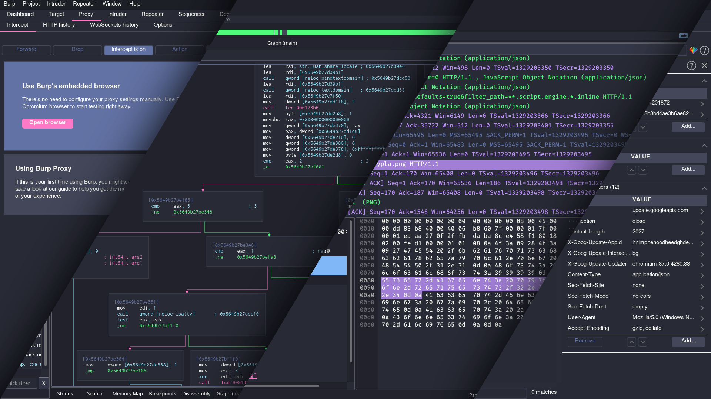
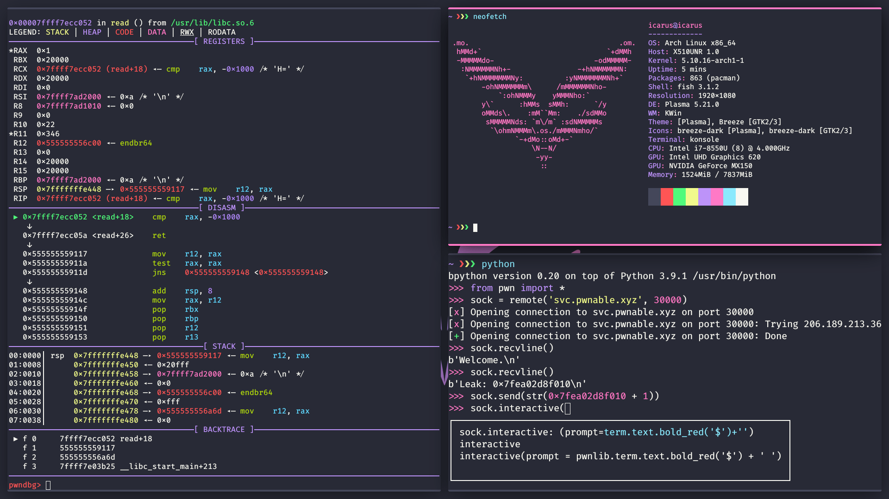
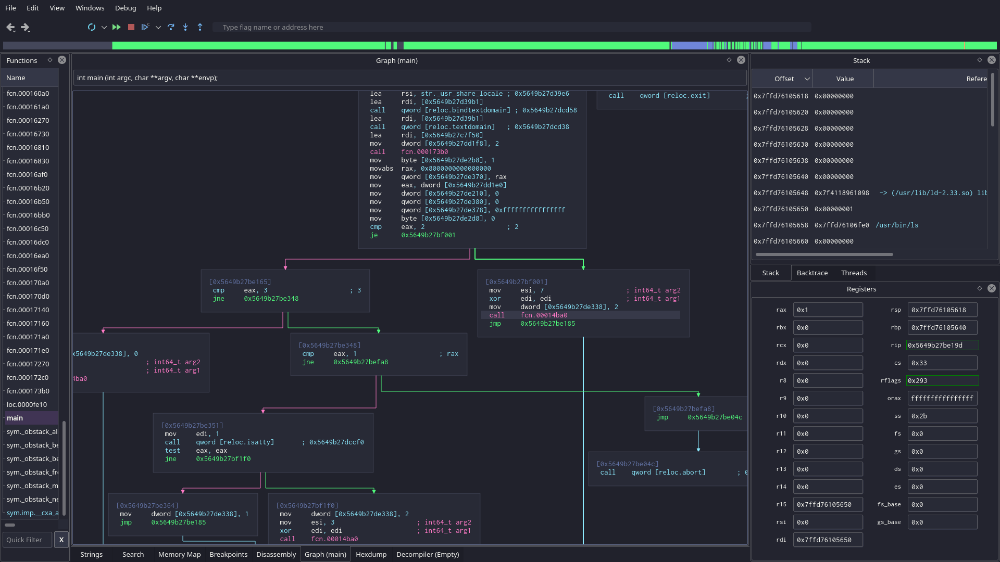
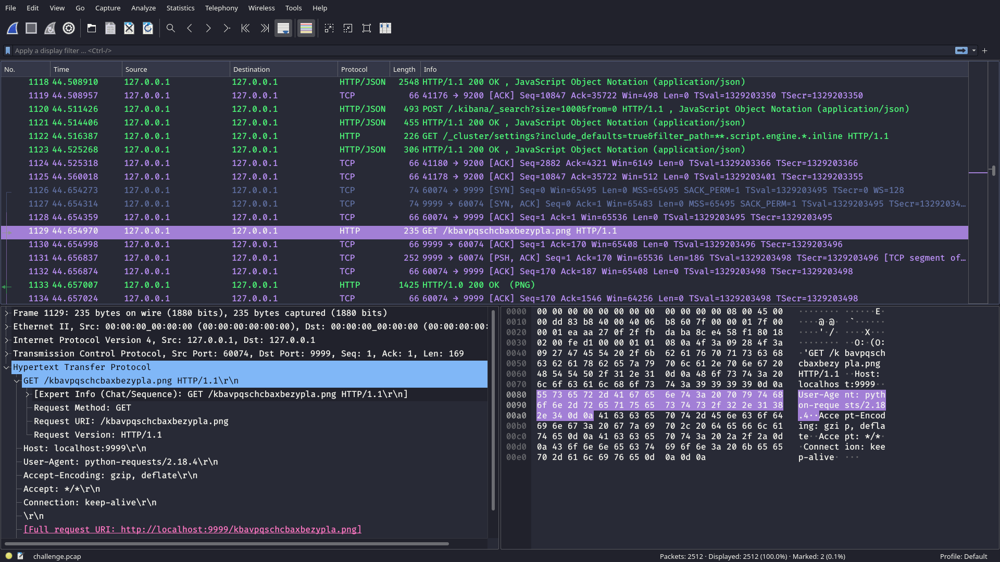

<div align="center">
<p>
    
</p>
<h1>Linux distribution for CTF players</h1>

[project webpage](https://roliboy.ml/projects/icarus/)
| [ISO downloads](https://roliboy.ml/projects/icarus/#download)

</div>

## Features

### Custom color themes
unified system-wide dark theme


### Automatic window tiling
with familiar keyboard shortcuts


### Tools for any challenge
binary, steganography, forensics, network and more


### Pre-configured environment
batteries included


### Pre-configured environment
batteries included


### Archstrike repository
large collection of high quality tools


### Visit the project's [webpage](https://roliboy.ml/projects/icarus/) for more information and iso downloads


## Build instructions

- Set up the custom [icarus package repository](https://github.com/roliboy/icarus-pkgbuilds)

```bash
git clone https://github.com/roliboy/icarus-pkgbuilds.git
```

- Build the packages

```bash
make
```

- Clone this repository

```bash
git clone https://github.com/roliboy/icarus.git
```

- Install archiso

```bash
sudo pacman -S archiso
```

- Build the image

```bash
sudo make
```